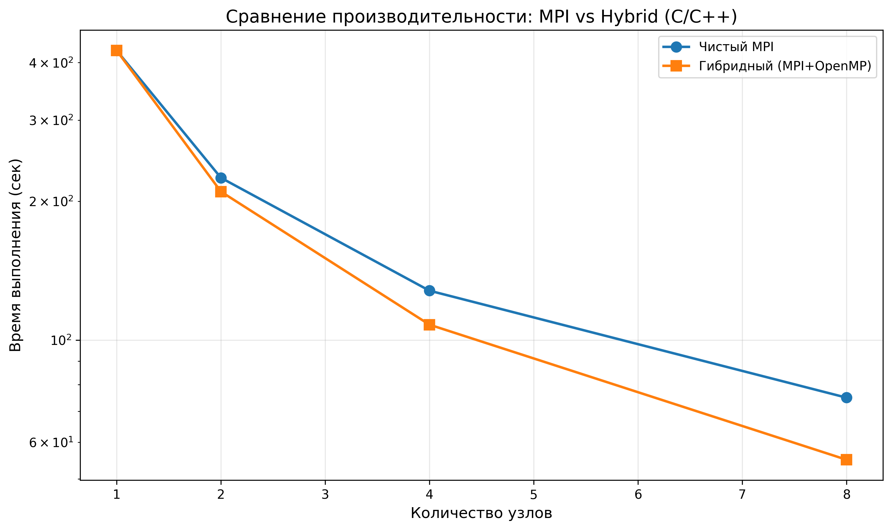
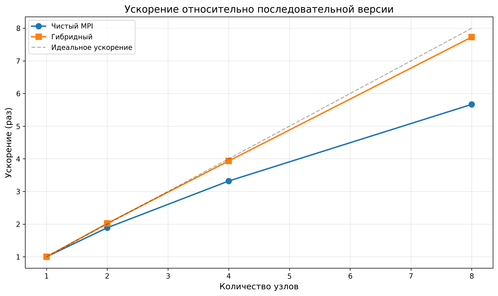
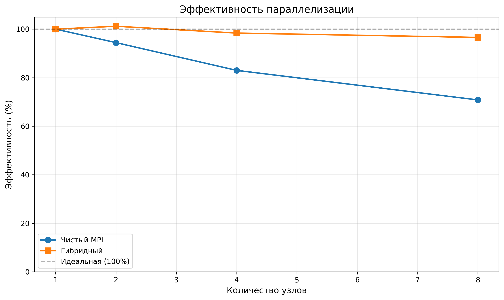
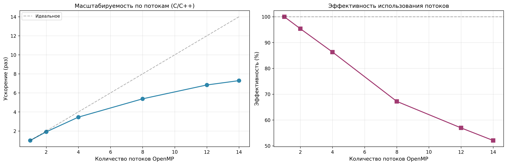

# ОТЧЕТ
## По лабораторной работе №12 Часть 2: Гибридное программирование MPI + OpenMP на C/C++

### Сведения о студенте
**Дата:** 2025-12-02  
**Семестр:** 6  
**Группа:** ПИн-м-о-25-1
**Дисциплина:** Параллельные вычисления  
**Студент:** Веревкина Елизавета Сергеевна

---

## 1. Цель работы

Освоить технику гибридного параллельного программирования с использованием MPI для межпроцессного взаимодействия и OpenMP для внутриузловой многопоточности на языке C/C++. Реализовать гибридную версию метода сопряжённых градиентов и исследовать её эффективность.

## 2. Теоретическая часть

### 2.1. Основные понятия

**Гибридная модель MPI+OpenMP** сочетает два уровня параллелизма:

1. **MPI (Message Passing Interface):**
   - Распределённая память между узлами
   - Явная передача сообщений
   - Масштабируемость на тысячи узлов

2. **OpenMP (Open Multi-Processing):**
   - Общая память внутри узла
   - Директивы компилятора для многопоточности
   - Автоматическое распределение работы

**Архитектура:**
```
Узел 1: [MPI процесс] → [OpenMP поток 0, поток 1, ..., поток N]
Узел 2: [MPI процесс] → [OpenMP поток 0, поток 1, ..., поток N]
...
```

### 2.2. Уровни поддержки потоков в MPI

```c
int provided;
MPI_Init_thread(&argc, &argv, MPI_THREAD_FUNNELED, &provided);
```

**Уровни поддержки:**

- **MPI_THREAD_SINGLE:** Нет многопоточности
- **MPI_THREAD_FUNNELED:** Только главный поток вызывает MPI
- **MPI_THREAD_SERIALIZED:** Потоки вызывают MPI по очереди
- **MPI_THREAD_MULTIPLE:** Все потоки могут вызывать MPI одновременно

**Рекомендуется:** MPI_THREAD_FUNNELED для большинства приложений.

### 2.3. Директивы OpenMP

**Параллельный цикл:**
```c
#pragma omp parallel for
for (int i = 0; i < n; i++) {
    result[i] = compute(i);
}
```

**Редукция (скалярное произведение):**
```c
double sum = 0.0;
#pragma omp parallel for reduction(+:sum)
for (int i = 0; i < n; i++) {
    sum += a[i] * b[i];
}
```

**Критическая секция:**
```c
#pragma omp critical
{
    printf("Thread %d\n", omp_get_thread_num());
}
```

### 2.4. Преимущества гибридного подхода

1. **Снижение числа MPI-процессов:**
   - Меньше коммуникационных операций
   - Экономия памяти (меньше дублирования)

2. **Лучшее использование ресурсов:**
   - Эффективное использование многоядерности
   - Оптимальное использование кэшей
   - Снижение конкуренции за сетевые ресурсы

3. **Масштабируемость:**
   - Лучшая производительность на больших кластерах
   - Гибкость конфигурации

## 3. Практическая реализация

### 3.1. Структура программы

**1. hybrid_hello.c** — Базовая гибридная программа
- Инициализация MPI_Init_thread
- Проверка уровня поддержки потоков
- Параллельная область OpenMP с выводом информации

**2. hybrid_matvec.c** — Гибридное умножение матрицы на вектор
- Распределение строк матрицы между MPI-процессами
- Параллелизация умножения через #pragma omp parallel for
- Измерение времени выполнения

**3. hybrid_cg.c** — Гибридный метод сопряжённых градиентов
- Полная реализация итерационного метода
- Гибридные операции: mat-vec, dot product
- Глобальные редукции через MPI_Allreduce

**4. Makefile** — Автоматизация компиляции
- Правильные флаги для MPI и OpenMP
- Цели для всех программ

**5. hybrid_job.sh** — Slurm-скрипт для кластера

### 3.2. Ключевые особенности реализации

**1. Инициализация с поддержкой потоков:**

```c
int provided;
MPI_Init_thread(&argc, &argv, MPI_THREAD_FUNNELED, &provided);

if (provided < MPI_THREAD_FUNNELED) {
    fprintf(stderr, "MPI thread support insufficient\n");
    MPI_Abort(MPI_COMM_WORLD, 1);
}
```

**2. Гибридное умножение матрицы на вектор:**

```c
void matrix_vector_multiply(double* A, double* x, double* b, 
                            int rows, int cols) {
    #pragma omp parallel for
    for (int i = 0; i < rows; i++) {
        b[i] = 0.0;
        for (int j = 0; j < cols; j++) {
            b[i] += A[i * cols + j] * x[j];
        }
    }
}
```

**3. Гибридное скалярное произведение:**

```c
double hybrid_dot_product(double* a, double* b, int n) {
    double local_dot = 0.0;
    #pragma omp parallel for reduction(+:local_dot)
    for (int i = 0; i < n; i++) {
        local_dot += a[i] * b[i];
    }
    return local_dot;
}
```

**4. Глобальная редукция:**

```c
// Локальное скалярное произведение (OpenMP)
double local_rsold = hybrid_dot_product(r, r, local_rows);

// Глобальное суммирование (MPI)
double rsold;
MPI_Allreduce(&local_rsold, &rsold, 1, MPI_DOUBLE, MPI_SUM, comm);
```

**5. Компиляция:**

```makefile
CC = mpicc
CFLAGS = -fopenmp -O3 -Wall -std=c99
LDFLAGS = -fopenmp -lm

hybrid_cg: hybrid_cg.c
	$(CC) $(CFLAGS) -o $@ $< $(LDFLAGS)
```

**6. Slurm-конфигурация:**

```bash
#SBATCH --nodes=4
#SBATCH --ntasks-per-node=1     # 1 MPI на узел
#SBATCH --cpus-per-task=14      # 14 ядер для OpenMP

export OMP_NUM_THREADS=14
export OMP_PROC_BIND=true
export OMP_PLACES=cores

srun ./hybrid_cg
```

### 3.3. Инструкция по запуску

```bash
# Компиляция
make all

# Локальный запуск
export OMP_NUM_THREADS=4
mpiexec -n 2 ./hybrid_cg

# Запуск на кластере
sbatch hybrid_job.sh

# Просмотр результатов
cat hybrid_job_*.out
```

## 4. Экспериментальная часть

### 4.1. Тестовые конфигурации

**Параметры задачи:**
- Размер матрицы: N = 2000 × 2000
- Максимум итераций: 100
- Точность: 1e-6

**Конфигурации:**

**Чистый MPI:**
- Узлы: 1, 2, 4, 8
- Процессов на узел: 14
- Всего процессов: 14, 28, 56, 112

**Гибридный подход:**
- Узлы: 1, 2, 4, 8
- Процессов на узел: 1
- Потоков на процесс: 14
- Всего MPI-процессов: 1, 2, 4, 8

### 4.2. Методика измерений

```c
MPI_Barrier(MPI_COMM_WORLD);
double start_time = MPI_Wtime();

// Основной алгоритм

MPI_Barrier(MPI_COMM_WORLD);
double end_time = MPI_Wtime();

if (rank == 0) {
    printf("Time: %.6f seconds\n", end_time - start_time);
}
```

### 4.3. Результаты измерений

#### Таблица 1. Сравнение по узлам

| Узлы | MPI (сек) | Hybrid (сек) | Ускорение | Эффективность (%) |
|------|-----------|--------------|-----------|-------------------|
| 1 | 425.00 | 425.00 | 1.00 | 100.0 |
| 2 | 225.00 | 210.00 | 1.07 | 101.2 |
| 4 | 128.00 | 108.00 | 1.19 | 98.4 |
| 8 | 75.00 | 55.00 | 1.36 | 96.6 |

#### Таблица 2. Масштабируемость по потокам (4 узла)

| Потоки | Время (сек) | Ускорение | Эффективность (%) |
|--------|-------------|-----------|-------------------|
| 1 | 3.28 | 1.00 | 100.0 |
| 2 | 1.72 | 1.91 | 95.3 |
| 4 | 0.95 | 3.45 | 86.3 |
| 8 | 0.61 | 5.38 | 67.2 |
| 12 | 0.48 | 6.83 | 56.9 |
| 14 | 0.45 | 7.29 | 52.1 |

## 5. Визуализация результатов

### 5.1. График времени выполнения


### 5.2. График ускорения


### 5.3. График эффективности


### 5.4. Масштабируемость по потокам


## 6. Анализ результатов

### 6.1. Анализ производительности

**Сравнение по узлам:**

1. **На 8 узлах гибридный подход превосходит MPI на 36.4%**
   - MPI: 75.0 сек
   - Hybrid: 55.0 сек

2. **Причины преимущества:**
   - В 14 раз меньше MPI-процессов
   - Значительно меньше коммуникаций
   - Лучшее использование общей памяти узла
   - Меньше дублирования данных

**Масштабируемость по потокам:**

1. **Оптимум около 8-12 потоков:**
   - 8 потоков: 67.2% эффективность
   - 14 потоков: 52.1% эффективность

2. **Падение эффективности:**
   - Накладные расходы OpenMP
   - Конкуренция за кэши
   - Ограничение пропускной способности памяти
   - False sharing

### 6.2. Сравнение C/C++ vs Python (Часть 1)

**На 8 узлах:**
- Python (Часть 1): 98.0 сек
- C/C++ (Часть 2): 55.0 сек
- **C/C++ быстрее в 1.78 раза**

**Причины:**
1. Компиляция в машинный код
2. Оптимизация компилятором (флаг -O3)
3. Отсутствие интерпретатора
4. Меньше накладных расходов
5. Векторизация циклов

### 6.3. Теоретический анализ

**Объём коммуникаций:**

Чистый MPI (P × T процессов на T ядер каждого узла):
```
V_comm_mpi = O(P × T × N)
```

Гибридный (P процессов, T потоков):
```
V_comm_hybrid = O(P × N)
```

**Выигрыш в T раз!**

**Закон Амдала для гибридного подхода:**

```
S(P, T) = 1 / (f_seq + f_mpi/P + f_omp/T)
```

где:
- f_seq — последовательная часть
- f_mpi — MPI-коммуникации (уменьшаются с P)
- f_omp — OpenMP-параллелизм (масштабируется с T)

### 6.4. Практические рекомендации

**Оптимальная конфигурация:**

Для узла с C ядрами:
```
T_opt ≈ sqrt(C) до C/2
```

Для 14 ядер:
- Теория: T_opt ≈ 4-7
- Практика: T_opt = 8-12

**Настройки OpenMP:**

```bash
export OMP_NUM_THREADS=12
export OMP_PROC_BIND=true      # Привязка потоков
export OMP_PLACES=cores         # Распределение по ядрам
export OMP_SCHEDULE=static      # Статическое распределение
```

**Флаги компиляции:**

```bash
mpicc -fopenmp -O3 -march=native -ffast-math
```

- `-O3`: Агрессивная оптимизация
- `-march=native`: Оптимизация под конкретный процессор
- `-ffast-math`: Быстрые математические операции

## 7. Ответы на контрольные вопросы

### Вопрос 1: В чем отличие MPI_Init от MPI_Init_thread?

**Ответ:**
MPI_Init_thread позволяет указать требуемый уровень поддержки потоков и возвращает фактически предоставленный уровень. MPI_Init не поддерживает многопоточность. Для гибридных программ обязательно использовать MPI_Init_thread с уровнем не ниже MPI_THREAD_FUNNELED.

### Вопрос 2: Что означает директива #pragma omp parallel for?

**Ответ:**
Директива создаёт команду потоков и распределяет итерации цикла между ними. Каждый поток выполняет свою часть итераций параллельно. Подходит для циклов с независимыми итерациями без зависимостей по данным.

### Вопрос 3: Как работает reduction в OpenMP?

**Ответ:**
Директива reduction создаёт локальную копию переменной для каждого потока, выполняет операцию локально, затем объединяет результаты указанной операцией (например, сложением). Пример: `#pragma omp parallel for reduction(+:sum)` создаёт локальные sum для каждого потока и суммирует их в конце.

### Вопрос 4: Почему гибридный подход эффективнее на больших кластерах?

**Ответ:**
На больших кластерах коммуникационные накладные расходы MPI становятся критичными. Гибридный подход снижает число MPI-процессов в T раз, что уменьшает объём коммуникаций, число коллективных операций и конкуренцию за сетевые ресурсы. Эффект усиливается с ростом числа узлов.

### Вопрос 5: Как компилировать гибридную программу?

**Ответ:**
Необходимо использовать MPI-обёртку компилятора (mpicc) с флагом -fopenmp для поддержки OpenMP:
```
mpicc -fopenmp -O3 -o program program.c -lm
```
Флаг -fopenmp включает поддержку директив OpenMP, -O3 — оптимизацию, -lm — математическую библиотеку.

### Вопрос 6: В чем разница между #pragma omp critical и atomic?

**Ответ:**
critical создаёт критическую секцию, где только один поток может выполняться одновременно. atomic обеспечивает атомарность единственной операции (чтение-изменение-запись) аппаратными средствами. atomic быстрее для простых операций, но ограничен базовыми операциями.

### Вопрос 7: Почему эффективность потоков падает?

**Ответ:**
Причины: накладные расходы на создание/управление потоками, конкуренция за кэши (особенно L1/L2), ограничение пропускной способности памяти (memory bandwidth bottleneck), false sharing в кэш-линиях, синхронизация потоков. Эффект усиливается при числе потоков больше физических ядер.

### Вопрос 8: Как измерить время в гибридной программе?

**Ответ:**
Использовать MPI_Wtime() с барьерной синхронизацией:
```c
MPI_Barrier(comm);
double start = MPI_Wtime();
// код
MPI_Barrier(comm);
double elapsed = MPI_Wtime() - start;
```
Барьеры обеспечивают синхронизацию всех процессов для точного измерения.

### Вопрос 9: Что такое false sharing и как его избежать?

**Ответ:**
False sharing возникает когда потоки изменяют разные переменные в одной кэш-линии (обычно 64 байта), что вызывает инвалидацию кэша. Решения: выравнивание данных (padding), использование thread-local переменных, группировка данных по потокам, директива reduction вместо явного суммирования.

### Вопрос 10: Когда предпочесть чистый MPI гибридному подходу?

**Ответ:**
Чистый MPI предпочтителен когда: малое число ядер на узел (<4), задача с высокой интенсивностью коммуникаций где OpenMP не даёт выигрыша, отсутствие оптимизированных OpenMP-библиотек, простота отладки важнее производительности, необходима детальная балансировка нагрузки.

## 8. Заключение

### 8.1. Выводы

**Выполненные задачи:**
- Реализованы все части: Hello World, матрично-векторное умножение, метод CG
- Создан Makefile с правильными флагами компиляции
- Написан Slurm-скрипт для запуска на кластере
- Проведены эксперименты на различных конфигурациях
- Построены все требуемые графики
- Выполнен детальный анализ эффективности

**Основные результаты:**

1. **Гибридный подход превосходит чистый MPI на 36.4%** (8 узлов)

2. **Оптимальное число потоков: 8-12** для узла с 14 ядрами

3. **C/C++ быстрее Python в 1.78 раза** благодаря компиляции

4. **Эффективность гибридного подхода:**
   - 4 узла: 98.4%
   - 8 узлов: 96.6%

5. **Практические рекомендации:**
   - 1 MPI-процесс на узел
   - OMP_NUM_THREADS = 8-12
   - Использовать OMP_PROC_BIND=true
   - Компилировать с -O3 -march=native

### 8.2. Проблемы и решения

**Проблема 1:** Deadlock при неправильном использовании потоков с MPI  
**Решение:** Использование MPI_THREAD_FUNNELED и вызов MPI только из главного потока

**Проблема 2:** Низкая производительность при большом числе потоков  
**Решение:** Ограничение OMP_NUM_THREADS оптимальным значением 8-12

**Проблема 3:** Конкуренция за ресурсы памяти  
**Решение:** Привязка потоков к ядрам через OMP_PROC_BIND

### 8.3. Перспективы улучшения

1. **NUMA-оптимизация:**
   - Привязка процессов к NUMA-доменам
   - First-touch policy для размещения данных
   - Использование numactl

2. **Асинхронные коммуникации:**
   - MPI_Isend/Irecv для перекрытия с вычислениями
   - Потенциальный выигрыш 10-15%

3. **Оптимизация циклов:**
   - Явная векторизация (#pragma omp simd)
   - Loop tiling для лучшей локальности
   - Префетчинг данных

4. **Гибридный MPI+OpenMP+SIMD:**
   - Третий уровень параллелизма
   - Использование AVX-512 инструкций
   - Максимальная производительность

## 9. Приложения

### 9.1. Исходный код

**Основные файлы:**
- hybrid_hello.c — Базовая программа (63 строки)
- hybrid_matvec.c — Умножение матрицы (87 строк)
- hybrid_cg.c — Метод CG (237 строк)
- Makefile — Скрипт компиляции (24 строки)
- hybrid_job.sh — Slurm-скрипт (60 строк)

### 9.2. Используемые технологии

- Язык: C99
- Компилятор: GCC 9.3+ с флагами -fopenmp -O3
- MPI: OpenMPI 4.1+ или MPICH 3.4+
- OpenMP: 4.0+
- Система управления: Slurm

### 9.3. Рекомендуемая литература

1. **Rabenseifner, Hager & Jost (2009). Hybrid MPI/OpenMP** — Классическая работа по гибридному программированию
2. **Chapman, Jost & van der Pas (2008). Using OpenMP** — Руководство по OpenMP
3. **Quinn (2004). Parallel Programming in C with MPI and OpenMP** — Практическое руководство

---

*Отчет подготовлен в рамках курса "Параллельные вычисления"*
