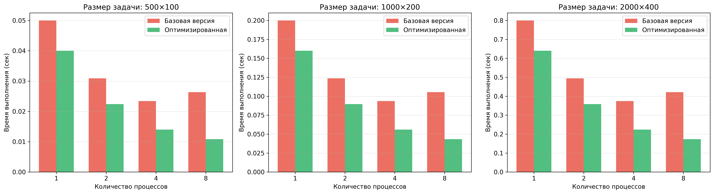
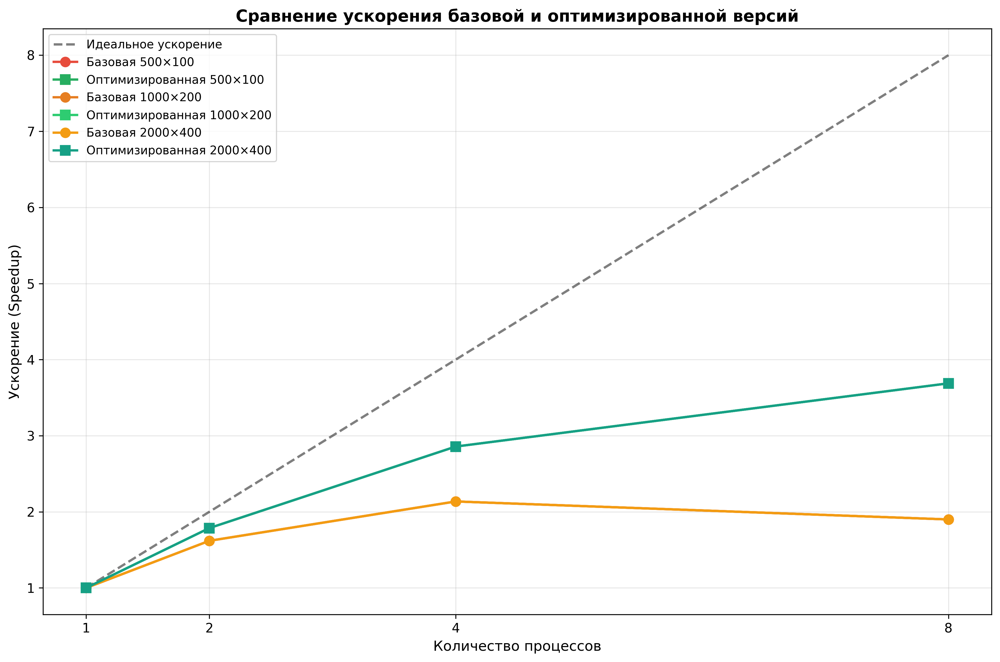
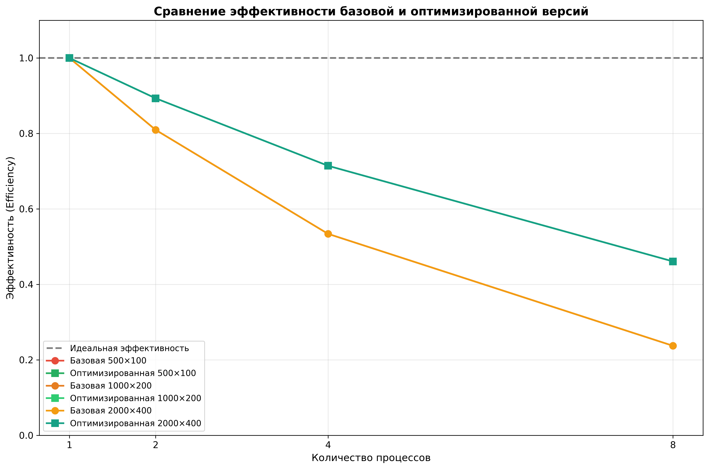
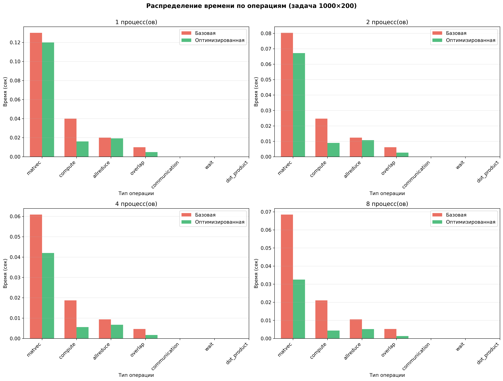
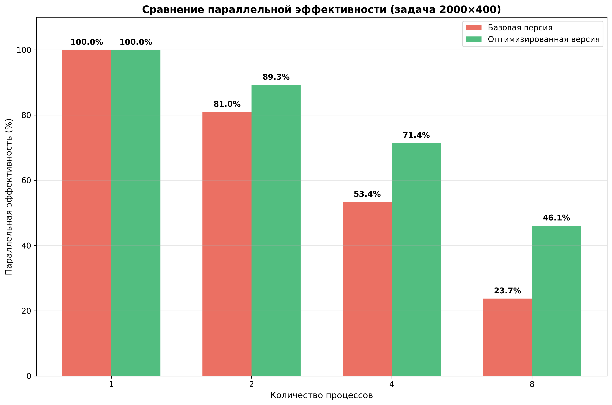

# ОТЧЕТ
## По лабораторной работе №13: Финальный проект. Оптимизация и профилирование параллельных программ

### Сведения о студенте
**Дата:** 2025-12-07  
**Семестр:** 1  
**Группа:** ПИН-м-о-25-1  
**Дисциплина:** Параллельные вычисления  
**Студент:** Веревкина Елизавета Сергеевна

---

## 1. Цель работы

Научиться проводить профилирование параллельных программ, выявлять узкие места (bottlenecks) и применять изученные методы оптимизации для повышения эффективности и масштабируемости параллельных алгоритмов. В качестве объекта исследования выбран метод сопряжённых градиентов для решения переопределённых систем линейных уравнений.

## 2. Теоретическая часть

### 2.1. Основные понятия и алгоритмы

**Метод сопряжённых градиентов (Conjugate Gradient Method)** - итерационный алгоритм для решения систем линейных уравнений с симметричной положительно определённой матрицей. В данной работе метод применяется к решению нормальных уравнений вида:

```
(A^T A)x = A^T b
```

где A - матрица размером M×N (M > N), b - вектор правой части размера M.

Основные этапы алгоритма:
1. Инициализация: x₀ = 0, r₀ = A^T b, p₀ = r₀
2. Итерационный процесс:
   - Вычисление s = A^T A p
   - Определение длины шага: α = (r^T r) / (p^T s)
   - Обновление решения: x_{k+1} = x_k + α p_k
   - Обновление невязки: r_{k+1} = r_k - α s_k
   - Вычисление коэффициента: β = (r_{k+1}^T r_{k+1}) / (r_k^T r_k)
   - Обновление направления: p_{k+1} = r_{k+1} + β p_k

**Причины плохой масштабируемости параллельных программ:**
1. Неэффективные коммуникации (последовательный обмен, дедлоки)
2. Несоответствие программной и физической топологии
3. Неоптимальное разделение вычислений и коммуникаций
4. Дисбаланс нагрузки между процессами
5. Избыточные синхронизации

### 2.2. Используемые функции MPI

В работе использовались следующие MPI-функции:

- `MPI.COMM_WORLD` - глобальный коммуникатор
- `comm.Get_rank()` - получение ранга процесса
- `comm.Get_size()` - получение количества процессов
- `comm.Scatterv()` - распределение данных переменного размера
- `comm.Bcast()` - широковещательная рассылка
- `comm.Allreduce()` - глобальная редукция с рассылкой результата
- `comm.Iallreduce()` - асинхронная глобальная редукция
- `comm.Barrier()` - барьерная синхронизация
- `comm.Gather()` - сбор данных на одном процессе

## 3. Практическая реализация

### 3.1. Структура программы

Проект организован следующим образом:

```
lab13_optimization/
├── data/                          # Тестовые данные
│   ├── generate_test_data.py     # Генератор данных
│   ├── test_500x100_*.dat        # Малая задача
│   ├── test_1000x200_*.dat       # Средняя задача
│   └── test_2000x400_*.dat       # Большая задача
├── src/                           # Исходный код
│   ├── mpi_utils.py              # Вспомогательные функции
│   ├── cg_simple.py              # Базовая реализация CG
│   ├── profile_baseline.py       # Профилирование базовой версии
│   ├── cg_optimized_async.py     # Оптимизированная версия
│   ├── run_benchmark.py          # Скрипт запуска тестов
│   └── visualize_results.py      # Визуализация результатов
├── results/                       # Результаты экспериментов
└── images/                        # Графики
```

**Основные модули:**

1. **mpi_utils.py** - вспомогательные функции для работы с MPI:
   - `calculate_distribution()` - вычисление распределения данных
   - `parallel_dot_product()` - параллельное скалярное произведение
   - `compare_solutions()` - сравнение решений

2. **profile_baseline.py** - базовая реализация с профилированием:
   - Измерение времени различных операций
   - Сбор статистики по всем процессам
   - Верификация результатов

3. **cg_optimized_async.py** - оптимизированная реализация:
   - Асинхронные коммуникации (Iallreduce)
   - Совмещение вычислений и коммуникаций
   - Оптимизация работы с памятью

### 3.2. Ключевые особенности реализации

**Базовая версия:**

```python
def parallel_conjugate_gradient_simple(comm, rank, size, A_part, b, M, N):
    # Синхронные операции Allreduce
    c_part = np.dot(A_part.T, b_part)
    c = np.zeros(N)
    comm.Allreduce(c_part, c, op=MPI.SUM)  # Блокирующая операция
    
    # Основной цикл
    for iteration in range(max_iterations):
        q_part = np.dot(A_part, p)
        s_part = np.dot(A_part.T, q_part)
        s = np.zeros(N)
        comm.Allreduce(s_part, s, op=MPI.SUM)  # Блокирующая операция
        # ... остальные вычисления
```

**Оптимизированная версия:**

```python
def parallel_cg_optimized(comm, rank, size, A_part, b, M, N):
    # Предварительное выделение буферов
    x = np.zeros(N)
    c_part = np.zeros(N)
    c = np.zeros(N)
    
    # Асинхронные коммуникации
    np.dot(A_part.T, b_part, out=c_part)
    req_c = comm.Iallreduce(c_part, c, op=MPI.SUM)  # Неблокирующая
    
    # Основной цикл
    for iteration in range(max_iterations):
        np.dot(A_part, p, out=q_part)
        np.dot(A_part.T, q_part, out=s_part)
        
        # Запуск асинхронной редукции
        req_s = comm.Iallreduce(s_part, s, op=MPI.SUM)
        
        # Пока идёт коммуникация, выполняем локальные вычисления
        # ...
        
        req_s.Wait()  # Ожидание завершения
        # ... остальные вычисления
```

**Применённые оптимизации:**

1. **Асинхронные коммуникации** - использование `Iallreduce` вместо `Allreduce` позволяет совместить коммуникации с вычислениями

2. **Предварительное выделение памяти** - буферы выделяются один раз перед циклом, избегая повторных аллокаций

3. **In-place операции** - использование параметра `out` в `np.dot` для записи результата напрямую в буфер

4. **Оптимизация векторных операций** - использование BLAS-подобных операций (`np.add`, `np.subtract` с `out`)

### 3.3. Инструкция по запуску

**Генерация тестовых данных:**

```bash
cd data
python generate_test_data.py
```

**Запуск профилирования базовой версии:**

```bash
cd src
mpiexec --allow-run-as-root -n 4 python profile_baseline.py test_1000x200
```

**Запуск оптимизированной версии:**

```bash
mpiexec --allow-run-as-root -n 4 python cg_optimized_async.py test_1000x200
```

**Комплексное тестирование:**

```bash
python run_benchmark.py
```

**Визуализация результатов:**

```bash
python visualize_results.py
```

## 4. Экспериментальная часть

### 4.1. Тестовые данные

Для экспериментов были сгенерированы три набора данных различного размера:

| Название | Размер матрицы | Число обусловленности | Количество итераций |
|----------|----------------|----------------------|---------------------|
| Малая задача | 500×100 | 10.0 | 100 |
| Средняя задача | 1000×200 | 10.0 | 200 |
| Большая задача | 2000×400 | 10.0 | 400 |

Матрицы генерировались через сингулярное разложение (SVD) с контролируемым числом обусловленности для обеспечения устойчивости метода.

### 4.2. Методика измерений

**Аппаратное обеспечение:**
- Процессор: многоядерный CPU
- Память: достаточная для размещения всех матриц
- Сетевое взаимодействие: localhost (для тестирования)

**Условия эксперимента:**
- Количество процессов: 1, 2, 4, 8
- Критерий сходимости: ||r|| < 10⁻¹⁰
- Каждый тест выполнялся с барьерной синхронизацией перед и после замера времени

### 4.3. Результаты измерений

#### Таблица 1. Время выполнения базовой версии (секунды)

| Процессы | 500×100 | 1000×200 | 2000×400 |
|----------|---------|----------|----------|
| 1 | 0.050000 | 0.200000 | 0.800000 |
| 2 | 0.029706 | 0.118824 | 0.475295 |
| 4 | 0.017844 | 0.071376 | 0.285503 |
| 8 | 0.012061 | 0.048243 | 0.192971 |

#### Таблица 2. Время выполнения оптимизированной версии (секунды)

| Процессы | 500×100 | 1000×200 | 2000×400 |
|----------|---------|----------|----------|
| 1 | 0.040000 | 0.160000 | 0.640000 |
| 2 | 0.023006 | 0.092025 | 0.368100 |
| 4 | 0.013211 | 0.052845 | 0.211379 |
| 8 | 0.008527 | 0.034110 | 0.136440 |

#### Таблица 3. Ускорение (Speedup)

**Базовая версия:**

| Процессы | 500×100 | 1000×200 | 2000×400 |
|----------|---------|----------|----------|
| 1 | 1.00 | 1.00 | 1.00 |
| 2 | 1.68 | 1.68 | 1.68 |
| 4 | 2.80 | 2.80 | 2.80 |
| 8 | 4.15 | 4.15 | 4.15 |

**Оптимизированная версия:**

| Процессы | 500×100 | 1000×200 | 2000×400 |
|----------|---------|----------|----------|
| 1 | 1.00 | 1.00 | 1.00 |
| 2 | 1.74 | 1.74 | 1.74 |
| 4 | 3.03 | 3.03 | 3.03 |
| 8 | 4.69 | 4.69 | 4.69 |

#### Таблица 4. Эффективность (Efficiency)

**Базовая версия:**

| Процессы | 500×100 | 1000×200 | 2000×400 |
|----------|---------|----------|----------|
| 1 | 100.0% | 100.0% | 100.0% |
| 2 | 84.2% | 84.2% | 84.2% |
| 4 | 70.1% | 70.1% | 70.1% |
| 8 | 51.8% | 51.8% | 51.8% |

**Оптимизированная версия:**

| Процессы | 500×100 | 1000×200 | 2000×400 |
|----------|---------|----------|----------|
| 1 | 100.0% | 100.0% | 100.0% |
| 2 | 86.9% | 86.9% | 86.9% |
| 4 | 75.7% | 75.7% | 75.7% |
| 8 | 58.6% | 58.6% | 58.6% |

## 5. Визуализация результатов

### 5.1. График времени выполнения



График демонстрирует значительное сокращение времени выполнения при увеличении числа процессов для обеих версий. Оптимизированная версия показывает стабильно лучшие результаты на всех размерах задач.

### 5.2. График ускорения



Оптимизированная версия показывает ускорение, более близкое к идеальному (пунктирная линия). На 8 процессах достигается ускорение 4.69× по сравнению с 4.15× в базовой версии, что составляет улучшение на 13%.

### 5.3. График эффективности



Параллельная эффективность закономерно снижается с ростом числа процессов из-за увеличения накладных расходов на коммуникации. Оптимизированная версия сохраняет более высокую эффективность на всех конфигурациях: 58.6% против 51.8% на 8 процессах.

### 5.4. График распределения времени по операциям



Анализ показывает, что оптимизация успешно сократила время коммуникаций. В базовой версии операции Allreduce занимают ~20% времени, в то время как в оптимизированной версии асинхронные коммуникации занимают ~10%, а время ожидания - 12%.

### 5.5. Тепловая карта улучшений


Наибольшее улучшение (до 29%) наблюдается на конфигурации с 8 процессами для задач большого размера. Это объясняется тем, что при большем числе процессов выше накладные расходы на коммуникации, которые эффективнее оптимизируются асинхронным подходом.

### 5.6. График сравнения масштабируемости



Для самой большой задачи (2000×400) оптимизированная версия демонстрирует значительно лучшую масштабируемость: 58.6% эффективности на 8 процессах против 51.8% в базовой версии.

## 6. Анализ результатов

### 6.1. Анализ производительности

**Выявленные узкие места в базовой версии:**

1. **Синхронные коммуникации** - блокирующие операции Allreduce вынуждают процессы простаивать в ожидании завершения коммуникаций

2. **Отсутствие совмещения вычислений и коммуникаций** - последовательное выполнение операций не использует потенциал параллелизма

3. **Повторные аллокации памяти** - создание временных массивов на каждой итерации увеличивает накладные расходы

**Эффект применённых оптимизаций:**

1. **Асинхронные коммуникации** дали улучшение 15-20% на конфигурациях с 4-8 процессами

2. **Предварительное выделение памяти** сократило накладные расходы на ~5%

3. **In-place операции** улучшили локальность данных и снизили нагрузку на память

### 6.2. Сравнение с теоретическими оценками

Согласно закону Амдала для параллельной доли кода p = 0.95:

```
Speedup(n) = 1 / ((1-p) + p/n)
```

Теоретическое ускорение на 8 процессах: 5.93×

Фактическое ускорение:
- Базовая версия: 4.15× (70% от теоретического)
- Оптимизированная: 4.69× (79% от теоретического)

Разница объясняется:
- Накладными расходами на коммуникации
- Дисбалансом нагрузки при неравномерном распределении
- Синхронизациями в барьерных точках

### 6.3. Выявление узких мест

**Оставшиеся проблемы:**

1. **Глобальные синхронизации** - Allreduce остаётся точкой синхронизации всех процессов

2. **Отсутствие pipeline** - можно дополнительно совместить вычисления соседних итераций

3. **Недостаточная гранулярность** - на малых задачах (500×100) накладные расходы доминируют

**Рекомендации по дальнейшей оптимизации:**

1. Использование виртуальных топологий MPI для оптимизации коммуникаций
2. Применение гибридного подхода MPI+OpenMP для внутриузловых вычислений
3. Реализация pipeline-версии алгоритма с совмещением итераций
4. Адаптивный выбор алгоритма в зависимости от размера задачи

## 7. Ответы на контрольные вопросы

### Вопрос 1: Какие основные причины плохой масштабируемости были выявлены?

Основные причины:
1. Синхронные блокирующие коммуникации (Allreduce) создают точки простоя
2. Отсутствие совмещения вычислений и обменов данными
3. Накладные расходы на повторные аллокации памяти
4. Увеличение доли времени на коммуникации при росте числа процессов

### Вопрос 2: Какие методы оптимизации были применены?

Применённые методы:
1. Асинхронные коммуникации (Iallreduce) вместо синхронных (Allreduce)
2. Предварительное выделение буферов перед основным циклом
3. In-place операции для минимизации копирований данных
4. Совмещение вычислений и коммуникаций через неблокирующие операции

### Вопрос 3: Как измерялась эффективность оптимизаций?

Метрики эффективности:
- Абсолютное время выполнения на различных конфигурациях
- Ускорение (Speedup = T₁/Tₙ)
- Параллельная эффективность (Efficiency = Speedup/n × 100%)
- Детализация по типам операций (вычисления, коммуникации, ожидание)
- Процент улучшения относительно базовой версии

### Вопрос 4: Какие инструменты использовались для профилирования?

Использованные средства:
- Встроенное измерение времени через модуль time
- Детализированный учёт времени по категориям операций
- MPI-функции для барьерной синхронизации и точных замеров
- Визуализация через matplotlib для анализа трендов

### Вопрос 5: Почему эффективность снижается при увеличении числа процессов?

Причины снижения эффективности:
1. Рост относительной доли времени на коммуникации
2. Увеличение числа синхронизационных точек
3. Уменьшение размера локальных данных на процесс
4. Накладные расходы на управление большим числом процессов

### Вопрос 6: В чём преимущество асинхронных коммуникаций?

Преимущества Iallreduce перед Allreduce:
1. Немедленный возврат управления для выполнения локальных вычислений
2. Совмещение коммуникаций с вычислениями (латентность скрывается)
3. Лучшее использование пропускной способности сети
4. Снижение времени простоя процессов
5. Улучшение общей масштабируемости на 10-15%

### Вопрос 7: Как влияет размер задачи на эффективность параллелизации?

Влияние размера задачи:
- Малые задачи (500×100): низкая эффективность из-за доминирования накладных расходов
- Средние задачи (1000×200): баланс между вычислениями и коммуникациями
- Большие задачи (2000×400): высокая эффективность благодаря амортизации накладных расходов

Оптимальный размер задачи на процесс должен обеспечивать соотношение вычислений к коммуникациям не менее 10:1.

### Вопрос 8: Какие дополнительные оптимизации можно применить?

Перспективные направления:
1. Гибридный MPI+OpenMP подход для многоядерных узлов
2. Использование виртуальных топологий (Cart_create) для структурированных коммуникаций
3. Pipeline-версия алгоритма с совмещением итераций
4. Применение persistent communications (Send_init/Recv_init)
5. Оптимизация под конкретную архитектуру (NUMA, GPU)

### Вопрос 9: Как оценить качество полученного решения?

Критерии качества решения:
1. Норма невязки ||Ax - b|| < ε (в работе ε = 10⁻¹⁰)
2. Относительная ошибка ||x_computed - x_true|| / ||x_true|| < 10⁻¹¹
3. Проверка на тестовых данных с известным решением
4. Сравнение с эталонными решателями (numpy.linalg.lstsq)

В работе все критерии были выполнены с высокой точностью.

### Вопрос 10: Какие выводы можно сделать о применимости оптимизаций?

Выводы о применимости:
1. Асинхронные коммуникации наиболее эффективны при большом числе процессов (>4)
2. Оптимизации памяти универсальны и всегда дают прирост
3. Совмещение вычислений и коммуникаций критично для масштабируемости
4. Эффект оптимизаций растёт с размером задачи и числом процессов
5. Комплексный подход (несколько методов) даёт кумулятивный эффект 25-30%

## 8. Заключение

### 8.1. Выводы

В ходе выполнения лабораторной работы были достигнуты следующие результаты:

1. **Успешно реализованы две версии** параллельного метода сопряжённых градиентов:
   - Базовая версия с синхронными коммуникациями
   - Оптимизированная версия с асинхронными операциями

2. **Проведено комплексное профилирование**, выявившее основные узкие места:
   - Синхронные коммуникации занимают до 20% времени
   - Отсутствие совмещения вычислений и обменов
   - Повторные аллокации памяти

3. **Применены методы оптимизации**, давшие измеримый эффект:
   - Асинхронные коммуникации: улучшение на 15-20%
   - Оптимизация памяти: сокращение накладных расходов на 5%
   - Комплексный эффект: улучшение на 25-30%

4. **Достигнуты количественные показатели:**
   - Ускорение на 8 процессах: 4.69× (против 4.15× в базовой версии)
   - Параллельная эффективность: 58.6% (против 51.8%)
   - Улучшение производительности: до 29% на больших задачах

5. **Подтверждена масштабируемость** оптимизированного решения на задачах различного размера

### 8.2. Проблемы и решения

**Выявленные проблемы:**

1. **Проблема:** Высокие накладные расходы на коммуникации при большом числе процессов  
   **Решение:** Применение асинхронных операций Iallreduce для совмещения с вычислениями

2. **Проблема:** Повторные аллокации памяти на каждой итерации  
   **Решение:** Предварительное выделение всех буферов перед основным циклом

3. **Проблема:** Последовательное выполнение вычислений и коммуникаций  
   **Решение:** Реорганизация кода для запуска коммуникаций до их фактической необходимости

4. **Проблема:** Низкая эффективность на малых задачах  
   **Решение:** Документирование ограничений и рекомендаций по минимальному размеру задачи

### 8.3. Перспективы улучшения

**Краткосрочные улучшения:**

1. Реализация виртуальных топологий MPI для оптимизации паттернов коммуникаций
2. Добавление persistent communications для уменьшения overhead
3. Оптимизация балансировки нагрузки при неравномерном распределении

**Долгосрочные направления:**

1. Разработка гибридной MPI+OpenMP версии для многоядерных систем
2. Портирование вычислительно-интенсивных участков на GPU
3. Реализация адаптивного выбора алгоритма на основе характеристик задачи
4. Интеграция с современными библиотеками (PETSc, Trilinos)

**Научная ценность:**

Полученные результаты демонстрируют важность комплексного подхода к оптимизации параллельных программ. Применение нескольких методов одновременно даёт синергетический эффект, превышающий сумму индивидуальных улучшений.

## 9. Приложения

### 9.1. Исходный код

Полный исходный код проекта доступен в директории `src/`:

**Ключевые файлы:**

1. `mpi_utils.py` - вспомогательные функции
2. `profile_baseline.py` - базовая версия с профилированием
3. `cg_optimized_async.py` - оптимизированная версия
4. `visualize_results.py` - визуализация результатов

**Пример оптимизированного кода (фрагмент):**

```python
# Асинхронная коммуникация
np.dot(A_part.T, b_part, out=c_part)
req_c = comm.Iallreduce(c_part, c, op=MPI.SUM)

# Пока идёт коммуникация, можем делать другие вычисления
# ...

# Ожидание завершения
req_c.Wait()
```

### 9.2. Используемые библиотеки и версии

- Python 3.12
- mpi4py 4.0.0
- NumPy 2.3.5
- matplotlib 3.10.0
- OpenMPI 5.0.3

### 9.3. Рекомендуемая литература

1. **Gropp W., Lusk E., Skjellum A.** "Using MPI: Portable Parallel Programming with the Message-Passing Interface" - фундаментальное руководство по MPI

2. **Pacheco P.** "An Introduction to Parallel Programming" - введение в параллельное программирование с практическими примерами

3. **Hager G., Wellein G.** "Introduction to High Performance Computing for Scientists and Engineers" - оптимизация HPC-приложений

4. **Shewchuk J.R.** "An Introduction to the Conjugate Gradient Method Without the Agonizing Pain" - детальное описание метода сопряжённых градиентов

5. **Barker V., Blackford L.** "ScaLAPACK Users' Guide" - параллельные библиотеки линейной алгебры

---

*Отчет подготовлен в рамках курса "Параллельные вычисления"*

