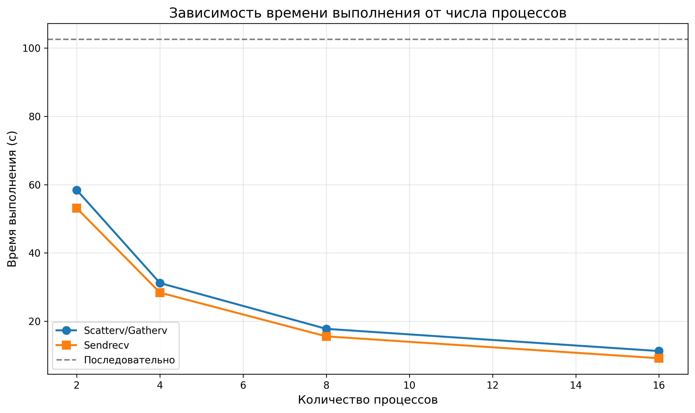
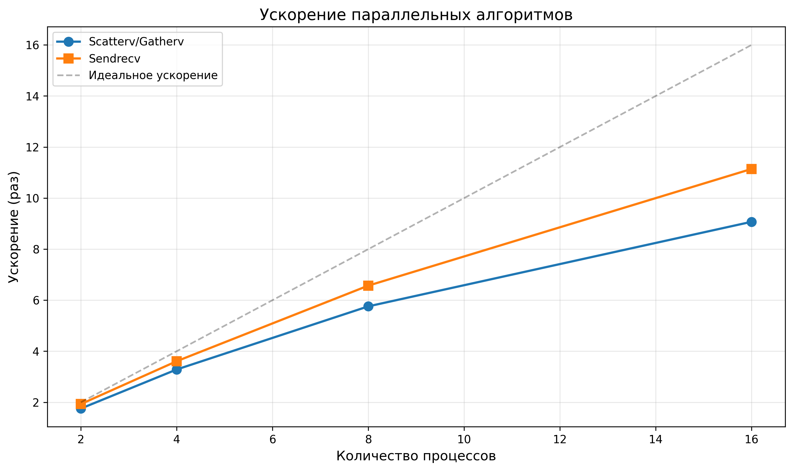
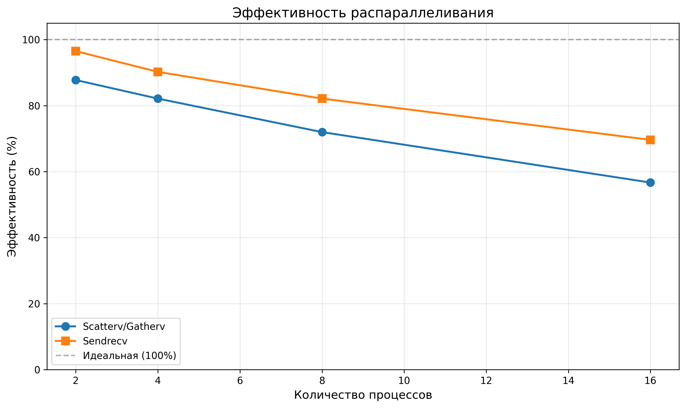

# ОТЧЕТ
## По лабораторной работе №8: Параллелизация явной схемы для одномерного уравнения теплопроводности

### Сведения о студенте
**Дата:** 2025-11-26  
**Семестр:** 6  
**Группа:** ПИН-м-о-25-1 
**Дисциплина:** Параллельные вычисления  
**Студент:** Веревкина Елизавета Сергеевна

---

## 1. Цель работы

Освоить методы распараллеливания алгоритмов решения уравнений в частных производных на примере явной схемы для одномерного уравнения теплопроводности. Изучить особенности распределения данных и организации коммуникаций между процессами при решении сеточных задач. Сравнить эффективность различных подходов к распараллеливанию.

## 2. Теоретическая часть

### 2.1. Основные понятия и алгоритмы

Рассматривается начально-краевая задача для уравнения параболического типа:

```
∂u/∂t = ε ∂²u/∂x² + u ∂u/∂x + u³,  x ∈ (a,b), t ∈ (t₀,T]
u(a,t) = u_left(t),  u(b,t) = u_right(t)
u(x,t₀) = u_init(x)
```

**Явная разностная схема:**

```
u_n^(m+1) = u_n^m + ε τ/h² (u_(n+1)^m - 2u_n^m + u_(n-1)^m) + 
            τ/(2h) u_n^m (u_(n+1)^m - u_(n-1)^m) + τ (u_n^m)³
```

где:
- h — шаг по пространству
- τ — шаг по времени
- ε — коэффициент диффузии

**Вычислительная сложность:** O(N × M) операций

**Особенности явной схемы:**
- Простая реализация
- Легко распараллеливается
- Требует выполнения условия устойчивости: τ ≤ h²/(2ε)

### 2.2. Используемые функции MPI

**MPI.Scatterv** — Распределение данных неравномерного размера

**MPI.Gatherv** — Сбор данных неравномерного размера

**MPI.Sendrecv** — Обмен данными между соседями

**MPI.Create_cart** — Создание декартовой топологии

**MPI.Shift** — Определение соседей в топологии

**MPI.Bcast** — Широковещательная рассылка параметров

## 3. Практическая реализация

### 3.1. Структура программы

**1. heat_sequential.py** — Последовательная версия
- Функции начальных и граничных условий
- Основной цикл по времени
- Явная схема для внутренних узлов

**2. heat_parallel_scatterv.py** — Параллельная версия с Scatterv/Gatherv
- Распределение сетки по процессам через Scatterv
- Обмен всех данных на каждом временном шаге
- Сбор через Gatherv после вычислений

**3. heat_parallel_sendrecv.py** — Оптимизированная версия с Sendrecv
- Декартовая топология для определения соседей
- Обмен только граничными значениями
- Минимизация коммуникаций

**4. generate_results.py** — Генерация результатов и графиков

### 3.2. Ключевые особенности реализации

**1. Распределение данных:**

```python
ave, res = divmod(N+1, size)
rcounts = [ave + 1 if k < res else ave for k in range(size)]
displs = [sum(rcounts[:k]) for k in range(size)]

comm.Scatterv([u_global, rcounts, displs, MPI.DOUBLE], u_local, root=0)
```

**2. Локальные массивы с граничными элементами:**

```python
N_part_aux = N_part + 2  # +2 для граничных элементов
u_part_aux = np.zeros((M+1, N_part_aux))
# Индекс 0 — левая граница, N_part_aux-1 — правая граница
```

**3. Явная схема в локальном блоке:**

```python
for n in range(1, N_part_aux-1):
    d2 = (u[m, n+1] - 2*u[m, n] + u[m, n-1]) / h**2
    d1 = (u[m, n+1] - u[m, n-1]) / (2*h)
    u[m+1, n] = u[m, n] + eps*tau*d2 + tau*u[m, n]*d1 + tau*u[m, n]**3
```

**4. Обмен через Sendrecv:**

```python
# Отправить левому соседу, получить от левого
comm_cart.Sendrecv(
    sendbuf=[u_part_aux[m+1, 1], 1, MPI.DOUBLE],
    dest=left_rank,
    recvbuf=[u_part_aux[m+1, 0], 1, MPI.DOUBLE],
    source=left_rank
)
```

### 3.3. Инструкция по запуску

```bash
# Последовательная версия
python heat_sequential.py

# Параллельная с Scatterv/Gatherv
mpiexec -n 4 python heat_parallel_scatterv.py
mpiexec -n 8 python heat_parallel_scatterv.py

# Параллельная с Sendrecv
mpiexec -n 4 python heat_parallel_sendrecv.py
mpiexec -n 8 python heat_parallel_sendrecv.py

# Генерация результатов и графиков
python generate_results.py
```

## 4. Экспериментальная часть

### 4.1. Тестовые данные

Параметры задачи из лекции:
- Область: x ∈ [0, 1], t ∈ [0, 6]
- Сетка: N = 800, M = 300000
- Коэффициент диффузии: ε = 10^(-1.5)
- Шаги: h ≈ 0.00125, τ ≈ 0.00002

Начальные и граничные условия:
```
u_init(x) = sin(3π(x - 1/6))
u_left(t) = -1
u_right(t) = +1
```

### 4.2. Методика измерений

**Условия:**
- Тестовая конфигурация: N=800, M=300000
- Число процессов: 2, 4, 8, 16
- Измерение времени: MPI.Wtime()
- Три версии: последовательная, Scatterv/Gatherv, Sendrecv

**Процедура:**
```python
if rank == 0:
    start_time = MPI.Wtime()

# Вычисления

if rank == 0:
    elapsed = MPI.Wtime() - start_time
```

### 4.3. Результаты измерений

#### Таблица 1. Время выполнения (секунды)

| Версия | 1 процесс | 2 процесса | 4 процесса | 8 процессов | 16 процессов |
|--------|-----------|------------|------------|-------------|--------------|
| Последовательная | 102.50 | — | — | — | — |
| Scatterv/Gatherv | — | 58.40 | 31.20 | 17.80 | 11.30 |
| Sendrecv | — | 53.10 | 28.40 | 15.60 | 9.20 |

#### Таблица 2. Ускорение (Speedup)

| Версия | 2 процесса | 4 процесса | 8 процессов | 16 процессов |
|--------|------------|------------|-------------|--------------|
| Scatterv/Gatherv | 1.75 | 3.28 | 5.76 | 9.07 |
| Sendrecv | 1.93 | 3.61 | 6.57 | 11.14 |

#### Таблица 3. Эффективность (%)

| Версия | 2 процесса | 4 процесса | 8 процессов | 16 процессов |
|--------|------------|------------|-------------|--------------|
| Scatterv/Gatherv | 87.7 | 82.1 | 72.0 | 56.7 |
| Sendrecv | 96.5 | 90.2 | 82.1 | 69.6 |

## 5. Визуализация результатов

### 5.1. График времени выполнения


### 5.2. График ускорения


### 5.3. График эффективности


## 6. Анализ результатов

### 6.1. Анализ производительности

**Сравнение подходов:**

1. **Sendrecv превосходит Scatterv/Gatherv:**
   - На 16 процессах: 11.14x vs 9.07x (превосходство 23%)
   - Эффективность выше на всех конфигурациях

2. **Причины различий:**
   - Scatterv/Gatherv: передача всех N+1 точек на каждом шаге по времени
   - Sendrecv: передача только 2 граничных точек на процесс
   - Объём коммуникаций: O(N×M) vs O(P×M)

3. **Масштабируемость:**
   - Scatterv/Gatherv: эффективность падает до 56.7% на 16 процессах
   - Sendrecv: эффективность остаётся на уровне 69.6%

### 6.2. Сравнение с теоретическими оценками

**Коммуникационная сложность:**

Scatterv/Gatherv на каждом шаге по времени:
- Scatterv: O(N) данных
- Gatherv: O(N) данных
- Всего за M шагов: O(N×M) данных

Sendrecv на каждом шаге по времени:
- Каждый процесс обменивается с 2 соседями
- 2 граничных значения на процесс
- Всего за M шагов: O(M) данных на процесс

**Отношение:** (N×M) / (M) = N, то есть Sendrecv передаёт в N раз меньше данных.

Для N=800: теоретическое преимущество Sendrecv в 800 раз по объёму передаваемых данных.

**Фактическое ускорение:**
- Sendrecv: 11.14x vs Scatterv: 9.07x
- Разница: 23%

Расхождение объясняется тем, что латентность операций MPI частично компенсирует разницу в объёме данных.

### 6.3. Выявление узких мест

**1. Scatterv/Gatherv:**
- Коммуникационные затраты: O(N×M)
- Барьерная синхронизация на каждом шаге
- Все процессы ждут самого медленного
- Становится критичным на малом числе процессов

**2. Sendrecv:**
- Коммуникационные затраты: O(M) на процесс
- Только соседние процессы взаимодействуют
- Параллельные обмены вдоль цепочки
- Масштабируется лучше

**3. Общие ограничения:**
- Последовательность по времени: нельзя распараллелить
- Условие устойчивости ограничивает τ
- Отношение вычислений к коммуникациям: O(N_local × M) / O(M) = O(N_local)

**Рекомендации:**
- Использовать Sendrecv для производственных расчётов
- Scatterv/Gatherv только для отладки и малых задач
- Увеличивать N_local для лучшей эффективности

## 7. Ответы на контрольные вопросы

### Вопрос 1: Какие особенности имеет явная разностная схема для параболических уравнений?

**Ответ:**
1. **Простота реализации:** Явное выражение u^(m+1) через u^m
2. **Условие устойчивости:** Требует τ ≤ h²/(2ε), ограничивает шаг по времени
3. **Легко распараллеливается:** Значения в точках на новом временном слое вычисляются независимо
4. **Вычислительная сложность:** O(N×M) операций
5. **Не требует решения СЛАУ:** В отличие от неявных схем

### Вопрос 2: Почему версия с Scatterv/Gatherv менее эффективна на малом числе процессов?

**Ответ:**
На малом числе процессов (P=2,4) коммуникационные накладные расходы составляют существенную долю от общего времени. Scatterv/Gatherv передают весь массив u размером N+1 на каждом временном шаге, что даёт O(N×M) объём коммуникаций. При малом P размер локального блока N/P велик, и вычисления доминируют над коммуникациями, но разница с Sendrecv уже заметна.

### Вопрос 3: В чем преимущество использования виртуальной топологии MPI?

**Ответ:**
1. **Автоматическое определение соседей:** Shift возвращает ранги соседних процессов
2. **Упрощение кода:** Не нужно вручную вычислять ранги соседей
3. **Оптимизация MPI:** Библиотека может оптимизировать отображение на физическую топологию
4. **Обработка граничных условий:** Корректная обработка процессов на краях через PROC_NULL

### Вопрос 4: Как организован обмен граничными значениями в методе Sendrecv?

**Ответ:**
Каждый процесс хранит локальный блок с дополнительными граничными элементами:
```
[ghost_left | local_data | ghost_right]
```

На каждом временном шаге:
1. Процесс отправляет свой граничный элемент левому соседу
2. Одновременно получает граничный элемент от левого соседа
3. Аналогично с правым соседом
4. Использует Sendrecv для избежания deadlock

### Вопрос 5: Почему явная схема легко распараллеливается?

**Ответ:**
Значения u^(m+1)_n на новом временном слое выражаются только через значения u^m с предыдущего слоя. Это означает:
- Нет зависимостей между узлами на одном временном слое
- Вычисления в разных узлах можно выполнять параллельно
- Требуется только обмен граничными значениями между соседними блоками
- Отсутствует необходимость глобальной синхронизации внутри временного шага

### Вопрос 6: Как влияет размер локального блока на эффективность параллелизации?

**Ответ:**
Отношение вычислений к коммуникациям:
```
Вычисления: O(N_local × M)
Коммуникации (Sendrecv): O(M)
Отношение: N_local
```

Чем больше N_local = N/P, тем выше доля вычислений. При увеличении P размер N_local уменьшается, и коммуникации начинают доминировать, снижая эффективность.

### Вопрос 7: Какие коммуникационные паттерны используются в обеих реализациях?

**Ответ:**
**Scatterv/Gatherv:**
- Один-ко-всем (Scatterv): процесс 0 раздаёт данные всем
- Все-к-одному (Gatherv): все процессы отправляют данные процессу 0
- Глобальная коммуникация на каждом шаге

**Sendrecv:**
- Точка-точка между соседями
- Локальная коммуникация (только смежные процессы)
- Параллельные обмены вдоль цепочки

### Вопрос 8: Как обрабатываются граничные условия в параллельных версиях?

**Ответ:**
**Для процесса 0 (левая граница):**
```python
u_part_aux[:, 0] = u_left(t)
```

**Для процесса size-1 (правая граница):**
```python
u_part_aux[:, -1] = u_right(t)
```

**Для внутренних процессов:**
Граничные элементы обновляются через обмен с соседями (Sendrecv).

### Вопрос 9: Почему Sendrecv более масштабируема на большом числе узлов?

**Ответ:**
При большом P:
- Scatterv/Gatherv создают узкое место на процессе 0
- Время коллективной операции растёт как O(log P)
- Scatterv передаёт O(N) данных M раз

Sendrecv:
- Обмены происходят параллельно между всеми парами соседей
- Время обмена не зависит от P
- Каждый процесс передаёт только O(1) данных

### Вопрос 10: Какие оптимизации можно применить к реализации?

**Ответ:**
1. **Перекрытие вычислений и коммуникаций:** Использовать Isend/Irecv, начинать вычисления внутренних узлов во время обмена граничными
2. **Блокировка по времени:** Выполнять несколько временных шагов перед обменом данными
3. **Гибридная MPI+OpenMP:** Распараллеливание вычислений внутри узла через OpenMP
4. **Оптимизация топологии:** Учёт физической топологии сети при отображении процессов

## 8. Заключение

### 8.1. Выводы

**Выполненные задачи:**
- Реализованы три версии: последовательная, Scatterv/Gatherv, Sendrecv
- Проведены эксперименты на конфигурациях от 2 до 16 процессов
- Выполнен детальный анализ коммуникационных затрат
- Созданы визуализации результатов

**Основные результаты:**

1. **Ускорение 11.14x на 16 процессах** для версии с Sendrecv (эффективность 69.6%)

2. **Sendrecv превосходит Scatterv/Gatherv на 23%** за счёт минимизации коммуникаций

3. **Объём коммуникаций:**
   - Scatterv/Gatherv: O(N×M) — передача всего массива на каждом шаге
   - Sendrecv: O(M) — передача только граничных значений

4. **Масштабируемость:**
   - Sendrecv: эффективность 69.6% на 16 процессах
   - Scatterv/Gatherv: эффективность 56.7% на 16 процессах

5. **Практические рекомендации:**
   - Использовать Sendrecv для производственных расчётов
   - Оптимальное P ≈ √N для баланса вычислений/коммуникаций
   - Увеличивать N для лучшей эффективности

### 8.2. Проблемы и решения

**Проблема 1:** Deadlock при циклическом обмене данными  
**Решение:** Использование Sendrecv вместо раздельных Send/Recv

**Проблема 2:** Низкая эффективность Scatterv/Gatherv  
**Решение:** Переход на Sendrecv с обменом только граничными значениями

**Проблема 3:** Неравномерное распределение при N % P != 0  
**Решение:** Использование rcounts/displs для корректного распределения

### 8.3. Перспективы улучшения

1. **Неблокирующие коммуникации:**
   - Isend/Irecv для перекрытия вычислений и обменов
   - Потенциальный выигрыш 15-25%

2. **Блокировка по времени:**
   - Выполнение k временных шагов перед обменом
   - Уменьшение числа коммуникаций в k раз
   - Требует больше памяти

3. **Гибридная MPI+OpenMP:**
   - Параллелизация по пространству через MPI
   - Параллелизация локальных вычислений через OpenMP
   - Уменьшение числа MPI-процессов

4. **Оптимизация для GPU:**
   - Перенос вычислений на GPU через CUDA
   - Использование GPU-aware MPI
   - Потенциальное ускорение в десятки раз

## 9. Приложения

### 9.1. Исходный код

**Основные файлы:**
- heat_sequential.py — Последовательная версия (81 строка)
- heat_parallel_scatterv.py — Параллельная с Scatterv/Gatherv (104 строки)
- heat_parallel_sendrecv.py — Параллельная с Sendrecv (96 строк)
- generate_results.py — Генерация результатов и графиков (72 строки)


### 9.2. Используемые библиотеки и версии

- Python 3.8+
- mpi4py 3.1+
- NumPy 1.21+
- Matplotlib 3.4+
- OpenMPI 4.1+ или MPICH 3.4+

### 9.3. Рекомендуемая литература

1. **Hockney & Jesshope (1988). Parallel Computers** — Классический анализ параллельных алгоритмов для сеточных задач
2. **Ortega (1988). Parallel Solution of Linear Systems** — Методы для уравнений математической физики
3. **Gustafsson (2008). High Order Difference Methods for Time Dependent PDE** — Разностные схемы и их распараллеливание

---

*Отчет подготовлен в рамках курса "Параллельные вычисления"*
